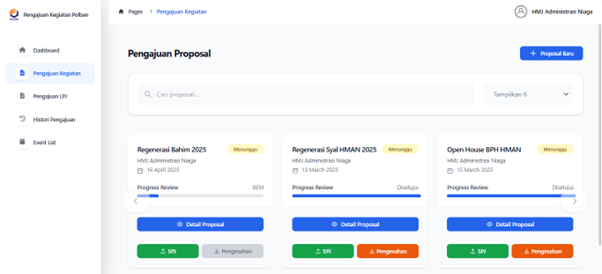
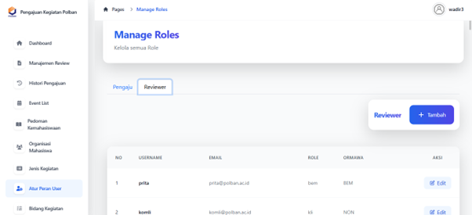
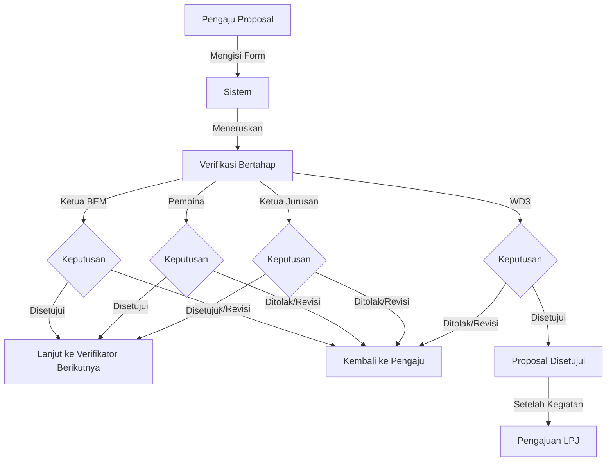

<h1 align="center">Aplikasi Pengajuan Proposal Digital</h1>
<p align="center">
  <b>Digitalisasi proses pengajuan, verifikasi, dan pelaporan proposal kegiatan ormawa</b>
</p>

<p align="center">
  
  
  
  
  
</p>

## 📋 Deskripsi

Aplikasi Pengajuan Proposal Digital adalah platform yang dikembangkan untuk mendigitalisasi proses pengajuan, verifikasi, dan pelaporan proposal kegiatan di lingkungan kampus. Aplikasi ini menggantikan sistem manual yang membutuhkan dokumen fisik dan tanda tangan berulang, sehingga mempercepat proses pengajuan dan meningkatkan transparansi.

## 🚀 Demo Aplikasi

<p align="center">
  
</p>
<p align="center">
  
</p>

## ✨ Fitur Utama

### 1. Pengajuan Proposal Digital
Penyelenggara kegiatan dapat mengajukan proposal kegiatan secara online, lengkap dengan dokumen yang diunggah secara digital.
<p align="center">
  
</p>

### 2. Review dan Persetujuan
Semua pihak terkait, seperti Ketua BEM, Pembina, Ketua Jurusan, dan WD3, dapat melakukan review proposal dan memberikan hasil keputusan berupa disetujui, perlu revisi, atau ditolak melalui platform tanpa perlu tanda tangan manual.
<p align="center">
  
</p>

### 3. Lembar Pengesahan dengan QR Code
Setelah proposal disetujui, sistem akan menghasilkan lembar pengesahan digital yang dilengkapi dengan QR code sebagai bukti persetujuan yang sah dan dapat diverifikasi.
<p align="center">
  
</p>

### 4. Katalog Proposal
Penyelenggara dan pihak kampus dapat memantau proses review dan status proposal (menunggu, disetujui, revisi, ditolak) secara real-time melalui katalog proposal yang tersedia dalam platform.
<p align="center">
  
</p>

### 5. Panel Administrator
Admin dapat mengelola semua keperluan pendukung seperti akun pengguna, jenis kegiatan, penambahan pedoman kegiatan, dan konfigurasi sistem lainnya melalui akun khusus administrator.
<p align="center">
  
</p>

## 🌟 Manfaat

- **Mengatasi masalah akses dokumen proposal:** Sistem mengelola dokumen secara terpusat, sehingga pengaju tidak perlu memberikan akses manual ke link Google Drive. Semua file proposal tersimpan dan dapat diakses langsung oleh reviewer di dalam sistem.
- **Meningkatkan transparansi dan akuntabilitas proses:** Sistem memberikan catatan yang jelas dan terperinci mengenai setiap tahap pengajuan dan review proposal. Pengaju dan reviewer dapat melihat jejak audit yang menunjukkan perkembangan proposal dari awal hingga akhir.
- **Peningkatan efisiensi proses:** Dengan adanya notifikasi otomatis, pengaju proposal tidak perlu memeriksa status secara manual atau menunggu konfirmasi melalui aplikasi perpesanan. Ini menghemat waktu dan mempercepat proses pengambilan keputusan.

## 👥 Struktur Pengguna

Aplikasi ini memiliki beberapa tipe pengguna dengan hak akses berbeda:

### Pengaju
- Mengajukan proposal kegiatan dengan mudah dan cepat
- Mendapatkan umpan balik jelas dari reviewer
- Memperbaiki dan mengajukan kembali proposal jika diminta revisi

### Reviewer
- Memberikan review proposal secara efisien
- Memberikan keputusan berupa persetujuan, penolakan, atau revisi
- Memastikan semua proposal memenuhi syarat sebelum diteruskan

### Admin
- Mengelola data jenis kegiatan, bidang kegiatan, ormawa, pedoman, dan peran pengguna
- Menjamin sistem berjalan dengan lancar dan aman

### Sistem
- Memproses data pengajuan proposal dengan benar dan efisien
- Memberikan notifikasi status dan reminder secara otomatis
- Menjamin keamanan data pengguna dan integritas sistem

## 📊 Alur Kerja Sistem



## 🛠️ Teknologi yang Digunakan

- **Frontend:** HTML, CSS, Tailwind
- **Backend:** PHP dengan framework Laravel
- **Database:** PostgreSQL
- **Notification:** Email

## 📥 Instalasi dan Penggunaan

### Persyaratan Sistem
- PHP >= 8.0
- Composer
- NPM
- PostgreSQL

### Langkah Instalasi

1. Clone repositori
```bash
git clone https://github.com/AnnisaDianFadillah06/aplikasi-pengajuan-proposal.git
cd aplikasi-pengajuan-proposal
```

2. Instal dependensi
```bash
composer install
npm install
```

3. Salin file .env.example menjadi .env dan konfigurasi
```bash
cp .env.example .env
php artisan key:generate
```

4. Konfigurasi database di file .env

5. Migrasi dan isi database
```bash
php artisan migrate --seed
```

6. Jalankan aplikasi
```bash
php artisan serve
npm run dev
```

7. Akses aplikasi melalui browser di http://localhost:8000

## 📚 Proyek Ini Dikembangkan Oleh
### Proyek 3 - Kelompok 6

- Angelita Tapitta Hutahaean
- Annisa Dian Fadillah
- Dhea Putri Ananda
- Muhammad Harish Al Rasyidi
- Timothy Elroy

